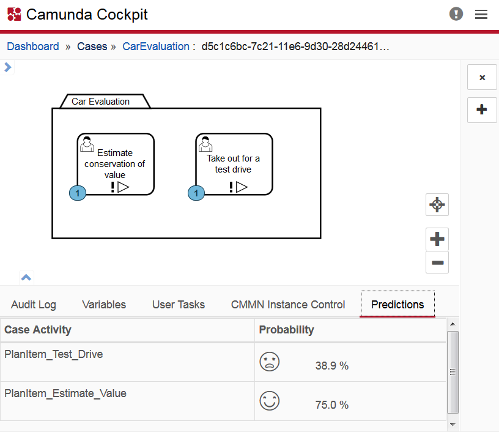
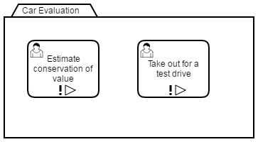
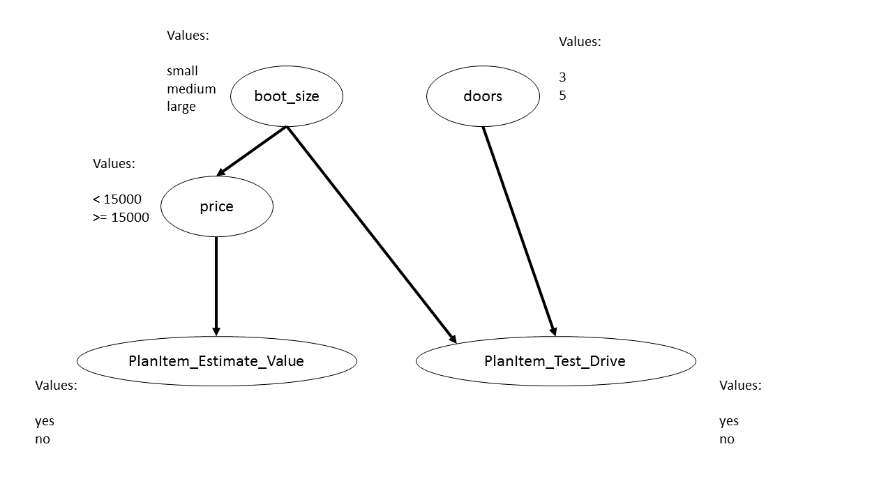

# Camunda CMMN Prediction

This project extends the Camunda CMMN engine by capabilites to make predictions over case instance variables and case instance activity execution. It can be used for recommending tasks to case workers in the context of a case instance. Probability distributions are learned over time whenever a case instance is closed. The formalism used is [Bayesian Networks](https://en.wikipedia.org/wiki/Bayesian_network) with multinomial distributions (aka table-based distributions).




## Components

* `embedded-api`: Independent of the process engine, implements persisting prediction models in custom database tables, updating model parameters, making predictions for a model with a given set of observations
* `process-engine-plugin`: A process engine plugin that consists of a deployer for JSON-encoded Bayesian Networks and a history event handler that updates model parameters with every closed case instance
* `cockpit-plugin`: A cockpit plugin that adds a *Prediction* tab to Cockpit's case instance view (note: CMMN Cockpit is to be released with 7.6.0 and restricted to Camunda Enterprise Edition)


## How to use

Have a look at the `example-application` module for a process application that deploys a CMMN case along with a Bayesian Network description. In the following, we look into the details.


### Setup

* Make the process-engine-plugin and its dependencies available on the process engine's and the Camunda web application's classpath
* Configure the process engine plugin `org.camunda.bpm.hackdays.prediction.plugin.CmmnPredictionPlugin` for a process engine
* Add the Cockpit plugin to the Camunda webapps (e.g. by dropping the jar in the Web app's `WEB-INF/lib` folder)


### Requirements

* Java 6 or higher should work to run this extension
* Java 8 for building the project from source
* This extension creates custom database tables and currently supports H2 only


### Developing a Prediction Model

Let's model a case of evaluating a car with two non-mandatory activities:



In order to make predictions, we need to provide a Bayesian network describing the variables relevant for prediction and their dependencies:



To explain the relation of the variables defined in this model and the variables as Java values in the context of a case instance, we refer to the former as *network variables* and the latter as *case instance variables*.

As network variables (ovals in the diagram), you can declare case activity instance state as well as data-based expressions. Network variables describing case activities by convention must have the same name as the corresponding plan item in the CMMN model. Their states are predefined to be binary: either the activity is performed or not. Data-based network variables are described by EL expressions based on case instance variables. Their states can be freely defined. In the example above, we have three data-based network variables with two and three states each.

Dependencies describe that outcomes of network variables are influenced by outcomes of other such variables. Defining dependencies is required to keep model inference computationally tractable and to create a model that generalizes well. Imagine a large model where a target plan item variable depends on all other variables. At runtime, the prediction component is going to learn probability distribution parameters for every assignment of the conditioning variables. Accordingly, it is going to take a long time until the learned probability distributions match the real-world behavior for every such assignment.

Dependencies can be freely chosen, with the restriction that the resulting graph must be acyclic. Identifying relevant dependencies can be hard. Get help from a domain expert.

Encoded in JSON, this looks as follows:

```json
{
  "variables" : {
    "doors" : {
      "type" : "custom",
      "categories" : [
        {"label" : "Three", "expression" : "doors == 3"},
        {"label" : "Five", "expression" : "doors == 5"}
      ]
    },
    "boot_size" : {
      "type" : "custom",
      "categories" : [
        {"label" : "Small", "expression" : "boot_size == 'small'"},
        {"label" : "Medium", "expression" : "boot_size == 'medium'"},
        {"label" : "Large", "expression" : "boot_size == 'large'"}
      ]
    },
    "price" : {
      "type" : "custom",
      "categories" : [
        {"label" : "Cheap", "expression" : "price < 15000"},
        {"label" : "Expensive", "expression" : "price >= 15000"}
      ]
    },
    "PlanItem_Estimate_Value" : {
      "type" : "binary"
    },
    "PlanItem_Test_Drive" : {
      "type" : "binary"
    }
  },
  "dependencies" : {
    "PlanItem_Estimate_Value" : ["price"],
    "PlanItem_Test_Drive" : ["boot_size", "doors"],
    "price" : ["boot_size"]
  }
}
```

Note the `variables` section that describes the network variables. For variables of type `custom` and its values, the `expression` attribute takes an EL expression that determines the value based on case instance variables. An expression must evaluate to `boolean`. The categories of a variable and their expressions must describe a partition over all possible case instance variable assignments. That means, given any case instance and its variables, every network variable must have exactly one matching value.

Deploy this along with your CMMN model. By convention, if the CMMN model's file name is `aCoolCase.cmmn`, the JSON file must be named `aCoolCase.cmmn.json`.


### Making Predictions in Cockpit

For this to work, the Camunda web applications of the Enterprise Edition are required with version >= 7.6.0-alphaX. Go to the details view of an active case instance and inspect the *Predictions* tab. It lists the probabilities of all case activity variables in the context of that instance.


### Making Predicitions via Java API

Aside from Cockpit, the `embedded-api` can be used to programmatically make probability queries. When using the process engine plugin, the `CmmnPredictionService` instance managed by the plugin can be retrieved via the static method `CmmnPredictionPlugin.getPredictionService(processEngine)`.

Fetch and query a deployed prediction model as follows:

```java
ProcessEngine processEngine = ..;
String caseInstanceId = ..;
String caseDefinitionId = ...;
CaseService caseService = processEngine.getCaseService();
CmmnPredictionService predictionService = CmmnPredictionPlugin.getPredictionService(processEngine);

// By convention, prediction model names correspond to case definition IDs
PredictionModel model = predictionService.getModel(caseDefinitionId);

String targetVariable = "PlanItem_Estimate_Value";

// Can be used to provide observations of network variables (e.g. if an activity was already performed);
// key is the network variable name; value the index of the variable value in the model
Map<String, Integer> observedAssignments = new HashMap<String, Integer>();

Map<String, Object> expressionContext = caseService.getVariables(caseInstanceId);

// Return value contains an entry for every value of the target variable along with the computed probability
// For binary variables, the keys are "true" and "false"
Map<String, Double> probabilities = predictionService.estimate(model, targetVariable, observedAssignments, expressionContext);
```


## How It Works

Bayesian networks describe a probability distribution over all network variables and how this distribution factorizes. In our example CMMN case, we describe the following joint distribution:

```
P(PlanItem_Estimate_Value, PlanItem_Test_Drive, price, boot_size, doors)
```

The dependencies encode that this distribution factorizes as:

```
P(PlanItem_Estimate_Value, PlanItem_Test_Drive, price, boot_size, doors) =
    P(PlanItem_Estimate_Value | price)
    * P(PlanItem_Test_Drive | boot_size, doors)
    * P(price | boot_size)
    * P(boot_size)
    * P(doors)
```

Assuming we know the family and parameters of these distributions, we can compute marginal probabilities like `P(PlanItem_Estimate_Value = true)` or `P(PlanItem_Estimate_Value = true | boot_size = 'large')`. These kinds of computations, called *inference*, are implemented in the [graphical-models](https://github.com/ThorbenLindhauer/graphical-models) library that this extension is based on.

In this application of Bayesian networks, we choose the involved distributions to be [multinomial](https://en.wikipedia.org/wiki/Multinomial_distribution), i.e. discrete distributions that describe a repeated expirement with `n` different outcomes. We can learn the parameters of the individual distributions that the joint distribution factorizes to. Since we don't know these parameters for sure, we can define another distribution over the parameters. For multinomial distributions, this distribution is typically a [Dirichlet distribution](https://en.wikipedia.org/wiki/Dirichlet_distribution) due to its nice computational properties. A Dirichlet has parameters itself and these can be interpreted as how often each outcome of the multinomial was previously observed. When making a prediction, we choose a single set of multinomial parameters by taking the Dirichlet's expectation. Whenever a case instance finishes, we update the Dirichlet's parameters according to the observed outcomes. The current implementation requires that all variables must be observed. Again, this learning component is part of the graphical-models library.


## What Is Possible But Not Implemented?

* Providing **prior distributions** along with the bayesian network. A prior encodes the belief about probability distributions before seeing any data. For example, if a domain expert knows under which circumstances an activity is typically performed, this can be encoded in the deployed model and the predictions become more accurate in the beginning with only few observed case instances.
* **Hybrid networks** of multinomial distributions and conditional linear Gaussian distributions (i.e. Gaussian distributions linearly dependent on other Gaussian or multinomial distributed variables). Haven't looked into the math yet ;)
* **Learning with incomplete observations**, i.e. where not all variables in a case instance have been observed.
* **Learning the structure of the network** from case instance data.
* Handling **CMMN repetitions**.


## Building from source

* before building, clone repository https://github.com/ThorbenLindhauer/graphical-models and build modules